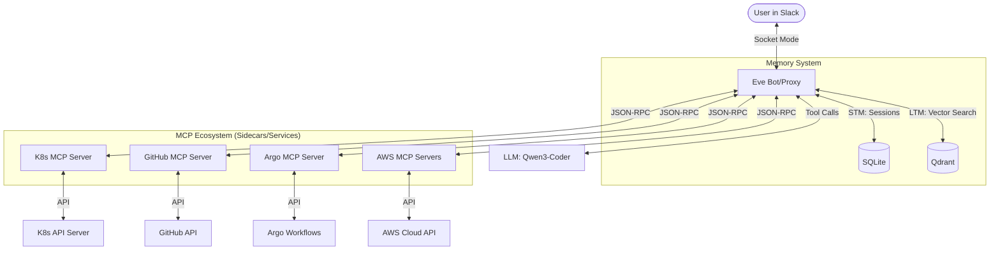
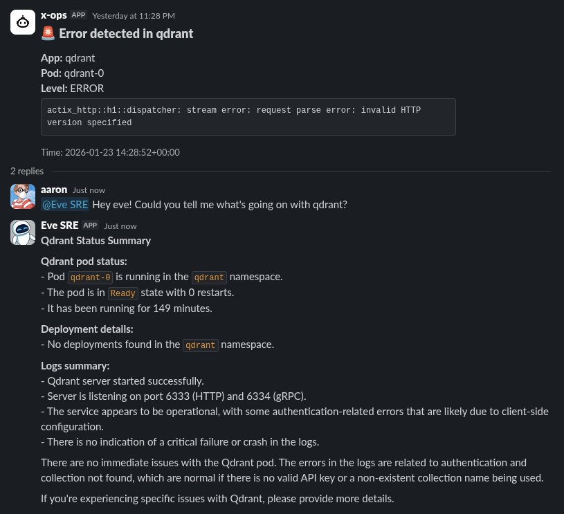

# Eve: The Autonomous SRE Slack Gateway

**Eve** is a next-generation Kubernetes operations agent built in Go. It functions as an intelligent **MCP (Model Context Protocol) Proxy** that connects your Slack workspace to a local LLM and a modular ecosystem of MCP servers.

Instead of hardcoding tools, Eve acts as a **Supervisor Agent** that dynamically discovers capabilities from external providers (Kubernetes, GitHub, Argo, etc.) and orchestrates them through natural language.

<p align="center">

</p>

---

## 🏗 Architecture

Eve sits at the intersection of your communication (Slack), your "brain" (Local LLM), and your tools (MCP Servers).



---

## 📸 Demo



---

## 🚀 Key Features

- **Philosophy: "Don't Reinvent the Wheel"**: Eve doesn't contain domain-specific logic. It focuses on the orchestration gateway, while domain logic is outsourced to standardized MCP servers.
- **Dynamic Tool Discovery**: At startup, Eve performs a handshake with all configured MCP servers to list and register their tools.
- **Agentic Supervisor**: Uses a ReAct-style loop to handle complex multi-step operations (e.g., "Find the failing pod, check its logs, and create a GitHub issue if it's an OOMKill").
- **Local-First AI**: Optimized for local LLM execution. Default-configured for **Qwen3-Coder** via `llama-cpp` or `Ollama`.
- **Zero-Ingress Security**: Uses Slack Socket Mode for outbound-only connections.
- **Sidecar Optimized**: Designed to run in Kubernetes with MCP servers as sidecars for low latency and shared RBAC.

---

## 🛠 Quick Start

### 1. Configuration

Eve can be configured via environment variables or a standard `mcp.json` file.

**`.env` Configuration:**
```bash
# Slack
SLACK_APP_TOKEN=xapp-...
SLACK_BOT_TOKEN=xoxb-...

# LLM (OpenAI-Compatible endpoint)
LLM_PROVIDER=openai
LLM_BASE_URL=http://qwen.home.lab:8003
LLM_MODEL=qwen3-coder

# MCP Servers (Comma-separated URLs)
MCP_SERVERS=http://localhost:8080,http://localhost:8081
```

**`mcp.json` Configuration:**
```json
{
  "mcpServers": {
    "kubernetes": { "url": "http://localhost:8080" },
    "github": { "url": "http://localhost:8081" },
    "aws-billing": { "url": "http://aws-billing:8083" }
  }
}
```

### 2. Deployment (Sidecar Pattern)

The recommended way to deploy Eve is with the official `kubernetes-mcp-server` as a sidecar:

```yaml
# manifests/base/deployment.yaml
containers:
  - name: eve
    image: harbor.home.lab/restack/eve:latest
    env:
      - name: MCP_SERVERS
        value: "http://localhost:8080"

  - name: mcp-kubernetes
    image: quay.io/podman/kubernetes-mcp-server:latest
    args: ["--port=8080"]
```

---

## 🤖 Recommended LLM

Eve is designed to work with models that have strong **Tool Calling (Functional Calling)** capabilities.

- **Recommended**: `qwen3-coder` (Excellent at precise tool selection and SRE tasks).
- **Alternative**: `qwen2.5:14b` or `llama3.1:8b` via Ollama.

---

## 📦 CI/CD

Eve includes a production-ready GitHub Actions workflow (`.github/workflows/build-image.yml`) that:
1. Builds a minimal Go binary into a scratch-based Docker image.
2. Pushes to your private registry (**Harbor**).
3. Automatically updates your GitOps manifests in your homelab repository.

---

## 🔧 Extensibility

Adding a new capability to Eve is as simple as adding a new URL to your `MCP_SERVERS` list. Whether it's a Jira agent, a database explorer, or a custom internal tool, as long as it speaks **MCP**, Eve can use it.

```bash
# Example: Adding a Jira MCP server
export MCP_SERVERS="http://k8s-mcp:8080,http://jira-mcp:8080"
```

---

## ⚖️ License

MIT © 2026 Restack / Eve Team
