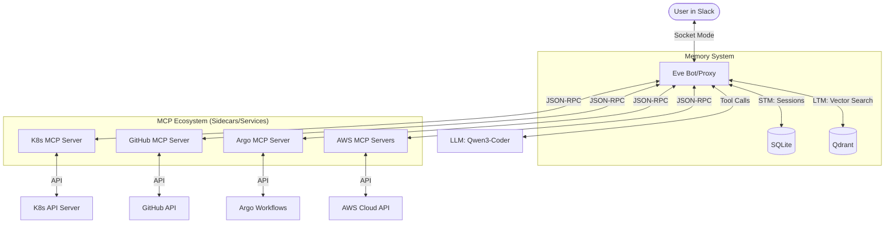

# Eve Documentation

Welcome to the documentation for **Eve**, your intelligent SRE Assistant. Use the guides below to set up, integrate, and understand the core systems of Eve.

---

## 🚀 Getting Started
- **[Local Setup Guide](./setup-guide.md)**: How to run Eve locally using `just`, configure environment variables, and start developing.

## 🔌 Integrations
- **[Slack Integration](./integrations/slack.md)**: Setting up the Slack App, Socket Mode, and Bot permissions.
- **[MCP Integration](./integrations/mcp.md)**: Connecting Eve to Kubernetes, AWS, and GitHub via MCP.

---

## 🏛️ System Architecture

Eve is designed as a modular, multi-layered supervisor agent. Each layer has a specific responsibility, from communication to long-term reasoning.

### 1. Communication Layer (Slack)
Eve utilizes **Slack Socket Mode** to receive events and mentions without requiring a public endpoint or ingress controller. This ensures that the agent can reside safely inside your internal network or cluster while maintaining real-time communication.

### 2. Core Orchestrator (The Agent)
The Go-based core acts as a **Supervisor**. When a request arrives:
1.  **Context Enrichment**: It fetches relevant short-term history from SQLite and long-term memories from Qdrant.
2.  **Reasoning Loop**: It presents the query and context to the LLM (Qwen3-Coder).
3.  **Tool Execution**: If the LLM requests a tool call, Eve executes it against the appropriate MCP server and feeds the result back into the loop.

### 3. Memory System (STM & LTM)
*   **Short-term Memory (STM)**: Managed via **SQLite**. It tracks active conversation sessions, thread context, and message counts. This allows Eve to maintain a coherent conversation within a Slack thread.
*   **Long-term Memory (LTM)**: Powered by **Qdrant Vector Database**. Every interaction and technical resolution is embedded into a vector space. This allows Eve to retrieve "similar" past incidents to help solve new problems.
*   *See the [Memory System Guide](./architecture/memory-system.md) for more details.*

### 4. MCP Ecosystem (The Tools)
Eve follows the **Model Context Protocol (MCP)**. Instead of hardcoding API clients, Eve connects to specialized MCP servers via JSON-RPC.
*   **Decoupled Logic**: The "how-to" of querying Kubernetes or AWS lives in the MCP server, not Eve.
*   **Dynamic Discovery**: Eve automatically discovers available tools from each server at startup.
*   *See the [MCP Integration Guide](./integrations/mcp.md) for more details.*

---

## 🛠️ Operational Tasks
For manual deployment and infrastructure details:
- **Kubernetes Manifests**: Check the `/manifests` directory for Kustomize bases.
- **Task Automation**: Use the `Justfile` in the root directory for common development tasks.
