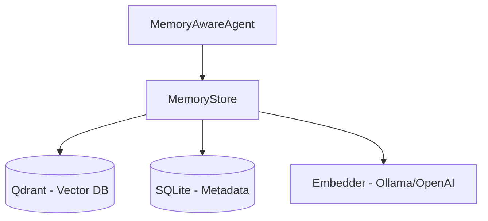

# Eve Memory System Guide

This document provides a comprehensive guide to the Eve Memory System, a persistent context engine designed to enhance SRE operations by remembering past interactions, incidents, and tool executions.

---

## 1. Overview

The Eve Memory System enables the agent to:
- **Maintain Longterm Context**: Retain information across Slack sessions and threads.
- **Semantic Search**: Retrieve relevant past experiences using vector embeddings (via Qdrant).
- **Metadata Tracking**: Store structured summaries and session statistics (via SQLite).
- **Proactive Insights**: Enrich current prompts with relevant past data to improve decision-making.

---

## 2. Architecture

Eve uses a hybrid storage approach to balance retrieval speed, semantic depth, and metadata management.



### Components
- **Qdrant**: Stores high-dimensional vectors for semantic search. It enables finding "similar" past incidents even if keywords don't match exactly.
- **SQLite**: Stores human-readable summaries, session data, and technology tags. Used for timeline views and statistical reporting.
- **Embedder**: Converts text (Observation Title + Summary + Content) into numerical vectors. Supports local **Ollama** (nomic-embed-text) or **OpenAI** API.

---

## 3. Data Model

### Observation
An **Observation** is the fundamental unit of memory.

| Field | Description |
| :--- | :--- |
| `Type` | tool_execution, incident, user_feedback, resolution, config_change, alert |
| `Category` | kubernetes, github, argo, etc. |
| `SessionID` | Links observations to a specific conversation session. |
| `Content` | The full raw output or description. |
| `Summary` | A concise version generated automatically or by LLM. |
| `Technologies` | Auto-extracted tags (e.g., `kubernetes`, `prometheus`, `redis`). |

---

## 4. How It Works

### 4.1 Recording (Storage)
When an action occurs (e.g., a tool is executed or an incident is detected), Eve:
1.  Extracts technical tags and generates a summary.
2.  Passes the text to the **Embedder** to create a vector.
3.  Saves the vector and full payload to **Qdrant**.
4.  Saves a summary index to **SQLite** for metadata queries.

### 4.2 Retrieval (Search)
When a user asks a question:
1.  Eve converts the user query into a vector.
2.  Performs a similarity search in **Qdrant** (filtered by channel/user if configured).
3.  Injects the top-scoring observations into the **System Prompt** as "Relevant Past Context".

---

## 5. Configuration

Enable and configure the memory system using environment variables.

| Variable | Default | Description |
| :--- | :--- | :--- |
| `MEMORY_ENABLED` | `false` | Set to `true` to enable the system. |
| `MEMORY_QDRANT_ADDR` | `localhost:6334` | gRPC address of the Qdrant server. |
| `MEMORY_SQLITE_PATH` | `/data/eve_memory.db` | Path to the local SQLite database file. |
| `MEMORY_EMBEDDER_TYPE` | `ollama` | Choice of `ollama` or `openai`. |
| `MEMORY_EMBEDDER_MODEL` | `nomic-embed-text` | Embedding model name. |
| `MEMORY_SEARCH_LIMIT` | `10` | Number of past memories to retrieve per query. |
| `MEMORY_MIN_SCORE` | `0.7` | Minimum similarity threshold (0.0 to 1.0). |

---

## 6. Deployment (Kubernetes)

The memory system is typically deployed as a sidecar or a dedicated service.

### Qdrant StatefulSet
A persistent StatefulSet is required to host the vector database.
- Port: `6333` (HTTP), `6334` (gRPC)
- Storage: 20Gi recommended for `qdrant-storage`.

### Persistence
The SQLite database requires a Persistent Volume Claim (`eve-memory-sqlite`) mounted at the path specified in `MEMORY_SQLITE_PATH`.

Refer to `manifests/memory/` for the full set of manifests.

---

## 7. Monitoring

Performance and health can be monitored via Prometheus:
- `eve_memory_search_latency_seconds`: Latency of semantic retrieval.
- `eve_memory_observations_stored_total`: Counter for successful memory records.
- `eve_memory_qdrant_healthy`: Gauge (1=Ok, 0=Error).

---

## 8. Development & Testing

Run tests locally (requires a Qdrant instance):
```bash
go test ./internal/memory/...
```

To use a development Mock (No-op) store in code:
```go
memStore := &memory.NoopMemoryStore{}
```
